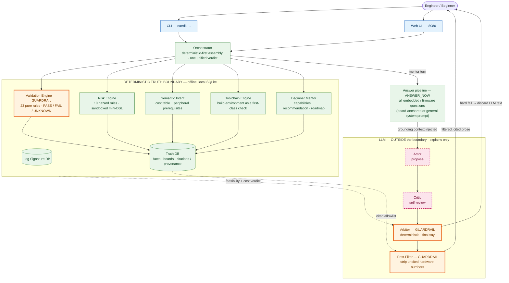
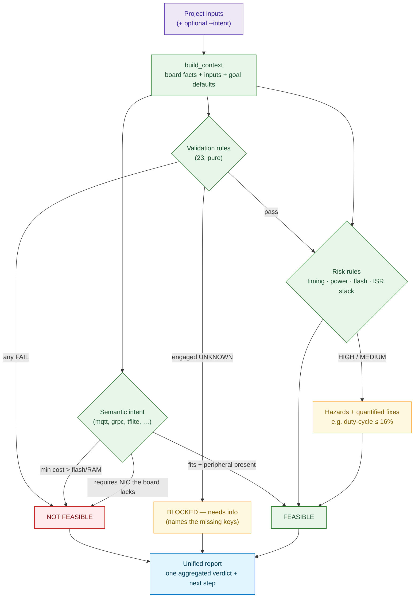
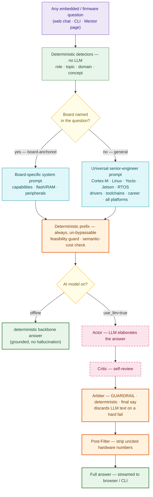

# EAEDK — Embedded AI Engineering Development Kit

**A local-first firmware mentor and validation engine. Deterministic engines hold the truth; an
optional local LLM only explains.** It tells a zero-experience engineer what a board can do, what
to build first and in what order, catches architectural mistakes *before* they build them, and
refuses — with the math — anything the hardware cannot do.

> ## The LLM cannot assert a hardware fact. It can only reason from what the database has verified.

Every other AI coding tool will happily tell you the STM32F407 runs at 168 MHz, invent a DDR
timing, or guess a register address — confidently, and sometimes wrong. On embedded hardware a
wrong value destroys boards. **EAEDK makes that failure mode structurally impossible.** The local
model sits *outside* a deterministic truth boundary and may only **explain, triage, and draft**
over data the engines have already verified; anything it says that isn't backed by a citation is
stripped before you read it.

---

## Getting started

EAEDK is pure Python (≥ 3.11) and runs the same on **Linux, macOS, and Windows** — one SQLite file,
no per-token cost, fully offline. The only thing that differs per OS is how you get Python and
activate the workspace.

### macOS / Linux

```bash
# 0. (once) get Python 3.11+ — macOS: `brew install python@3.11` (or python.org); most Linux has it.
git clone https://github.com/Ashut90/eaedk        # 1. download
cd eaedk                                            # 2. enter the folder
python3 -m venv .venv && source .venv/bin/activate  # 3-4. private workspace
pip install -e .                                    # 5. install the `eaedk` command
eaedk db init && eaedk db seed                      # 6-7. create + load the local database
eaedk board list                                    # 8. see the 14 built-in boards
eaedk mentor --board STM32F103-BluePill             # 9. ask the mentor (add --chat --llm for AI answers)
```

`eaedk board capabilities --board bluepill` shows what a board can do (fuzzy names like `bluepill`
are auto-coerced). For a back-and-forth AI conversation: `eaedk mentor --board <b> --chat --llm`.

### Windows (PowerShell)

Install **Python 3.11+** from [python.org](https://www.python.org/downloads/windows/) or the
Microsoft Store (tick *"Add python.exe to PATH"*), then in PowerShell:

```powershell
git clone https://github.com/Ashut90/eaedk         # 1. download (needs Git for Windows)
cd eaedk                                            # 2. enter the folder
py -m venv .venv ; .venv\Scripts\Activate.ps1       # 3-4. private workspace
pip install -e .                                    # 5. install the `eaedk` command
eaedk db init ; eaedk db seed                       # 6-7. create + load the local database
eaedk board capabilities --board bluepill           # 8. what can this board do?
```

> If PowerShell blocks the activate script, run once:
> `Set-ExecutionPolicy -Scope Process -ExecutionPolicy Bypass`. On Command Prompt (cmd.exe) the
> activate line is `.venv\Scripts\activate.bat`.

Typing `bluepill` instead of `STM32F103-BluePill` is fine — EAEDK auto-coerces and tells you.
Coming back later? `cd eaedk`, re-activate the workspace, and you're ready — steps 1–7 are one-time.

**Prefer a browser?** `pip install -e '.[web]'` then `eaedk web` → <http://localhost:8080> (all OSes).
**On Ubuntu/Debian** you can instead build a native package — `packaging/build-deb.sh` →
`sudo apt install ./dist/eaedk_*_all.deb` puts `eaedk` on your `$PATH` system-wide. (macOS and
Windows use the pip flow above — there is no native installer for them yet.)

### Pick your AI model (optional)

The mentor answers **offline by default** (deterministic). For *AI* answers (`--llm`, or the web
"Use the AI model" box) you choose the model with environment variables — no code change.

**Local & free — [Ollama](https://ollama.com):**

```bash
ollama pull llama3.1:8b                                  # recommended local default
EAEDK_MENTOR_MODEL=llama3.1:8b eaedk mentor --board STM32F103-BluePill --chat --llm
```

A 7–8B model is the sweet spot for a 6–8 GB GPU. **Avoid 3B models** — they recite templates instead
of reasoning. Note: any local model caps out below a frontier model's reasoning.

**Stronger reasoning — any OpenAI-compatible endpoint** (OpenCode Zen, Gemini's OpenAI API,
OpenRouter, a hosted vLLM):

```bash
export EAEDK_LLM_BASE_URL=https://opencode.ai/zen/v1     # the endpoint
export EAEDK_LLM_API_KEY=...                             # if it needs a key
export EAEDK_MENTOR_MODEL=deepseek-v4                    # the model id there
eaedk mentor --board STM32F103-BluePill --chat --llm
```

Either way EAEDK wraps the model with its deterministic grounding + verifier, so a stronger model
gives sharper answers **without** losing the no-hallucinated-hardware-facts guarantee.

---

## What's new — the "LLM generates, deterministic verifies" pivot

EAEDK used to **classify** your question and play back a stored template. Now the model **reads and
answers your specific question**, and the deterministic engines **verify** it. Full write-up:
[docs/35](docs/35-llm-generates-deterministic-verifies.md).

```
Your question
   │
   ▼
Intent router picks the answer mode
   ├─ debugging fault → deterministic PROOF-PATH (a curated decision tree)
   └─ open / concrete → the LLM reads the EXACT question
                          │  ← verified board / project facts injected as grounding
                          ▼
                        LLM answers the specific question
                          │
                          ▼  deterministic verifier — final say:
                             • invented a board fact?   → stripped   (allowlist post-filter)
                             • out of scope?             → declined  (purpose gate)
                             • unsafe / not feasible?    → overridden (feasibility arbiter)
                             • conceptually wrong?       → blocked   (conceptual guards)
                             • answered the question?    → bounded LLM relevance critic (advisory)
                          ▼
                        Final answer
```

**Major changes since v3.1:**

- **The pivot above** — the LLM generates the answer; the deterministic layer verifies it (was the reverse).
- **9 curated debugging proof-paths** across 5 project types — bare-metal (UART / I²C / SPI / power-reset / HardFault), RTOS, bootloader, Linux driver, edge-ML inference.
- **Conceptual guards** — block advice that's literal-clean but wrong (e.g. "add pull-ups to your SPI bus").
- **Skill-level calibration** — reads the user's self-described level; never hands an experienced engineer the beginner "blink an LED" path.
- **Pluggable models** — local Ollama *or* any OpenAI-compatible endpoint (see *Pick your AI model*).
- **Bounded "why" critic** for uncovered faults, and an honest offline fallback that never fakes a tailored answer.

---

## The three questions a beginner actually asks

```bash
eaedk board capabilities --board bluepill           # "What can this board do?"
eaedk mentor --board bluepill --level 0             # "What should I build first, and why?"
eaedk roadmap --board bluepill --goal firmware-job  # "How do I get a job with this?"
```

- **`board capabilities`** — architecture in plain language (Cortex-M3 = no FPU, simple ISR model),
  flash/RAM in human terms (*"64KB — fits a UART logger and a sensor driver, not a TFLite model"*),
  confirmed peripherals, **what EAEDK can and cannot validate** (UNKNOWN facts listed, never
  assumed), and the closest board by architecture + memory bracket.
- **`mentor --level 0`** — the first project *with the reason it comes first*, what it teaches, the
  next three in **dependency order**, and for each: which peripherals it exercises, the failure mode
  to expect, and how to diagnose it. A project needing an unconfirmed peripheral is flagged, never
  recommended on a guess.
- **`roadmap`** — a dependency graph (not a flat list) where each step states *what it proves to an
  interviewer*; pass several `--board` flags and it sequences across them (fundamentals on the
  smaller board, RTOS/HAL on the larger).

---

## Architectural flow

Two front doors call the same deterministic engine core; every fact flows through `repo.py` into
local SQLite. The LLM sits **outside** the trust boundary and reaches you only through an
Actor → Critic → **deterministic Arbiter** → Post-Filter pipeline. A mentor turn first passes a
deterministic **Purpose Decision** — answer / clarify / redirect / decline — before any of this runs
(see *[Reasoning workflow](#reasoning-workflow--how-the-mentor-actually-thinks)* below).



Full walk-through: **[docs/architecture.md](docs/architecture.md)** (includes *"What the Post-Filter
Does and Does Not Do"*) and **[docs/architecture-flow.md](docs/architecture-flow.md)**.

---

## Validation logic — how a request becomes one verdict

`eaedk validate <project> --intent "…"` runs **structural** checks and **behavioural intent**
together, aggregating hardware failures and intent-feasibility into a single report. A hard failure
anywhere — a rule FAIL, a memory overflow, or a missing peripheral — makes the whole project
`NOT FEASIBLE`.



---

## Reasoning workflow — how the mentor actually thinks

The mentor answers **any** embedded / firmware question. There is no topic gate that declines
Jetson, Yocto, career, or anything else in the field. The board you selected is only *context* —
it enriches the answer, never restricts the subject.

Every turn goes through the same pipeline:

1. **Deterministic detectors (no LLM)** — read role (PEER / ARCHITECT / SPONSOR), topic
   (engineering decision), domain (robotics / sensor / IoT), concept (HardFault, vector table…).
2. **System prompt selection** — board-specific prompt if the user named a board; otherwise a
   universal senior-engineer prompt covering the full embedded field (Cortex-M, Linux-on-hardware,
   Yocto, Nvidia Jetson, Raspberry Pi, RTOS, drivers, toolchains, career — everything).
3. **Un-bypassable grounding** — feasibility banner + semantic-cost check injected before the model.
4. **LLM call** (if enabled) → **Arbiter** (deterministic, final say) → **Post-Filter** (strips
   uncited hardware numbers).



The reasoning framework lives as curated Python data (`reasoning.py`), so the *thinking* holds
fully offline — an air-gapped mentor still teaches, not just plays back a stored answer. See
[docs/27-reasoning-framework.md](docs/27-reasoning-framework.md).

## Sample interactions you can expect

The selected board is always *context*, never a constraint on the subject. EAEDK answers the
question you actually asked — whether it names a board or not.
(Try them: Mentor page in `eaedk web`, or `eaedk mentor --board bluepill --ask "…" --llm`.)

| You ask | What you get |
|---|---|
| *"How do I start with Nvidia Jetson?"* | A complete Jetson-specific answer: JetPack SDK, GPIO via libgpiod, CUDA, camera pipeline — no board default substituted. |
| *"When should I use Yocto vs Buildroot?"* | Decision criteria: project lifetime, team size, BSP complexity, CI footprint. Both compared side-by-side with trade-offs. |
| *"Should I learn Zephyr or FreeRTOS?"* | The RTOS-vs-super-loop **decision criteria** — when each wins, per-task RAM cost, how to decide. Not "start with blink." |
| *"I want to become a firmware engineer — where do I start?"* | An ordered learning **path**: blink → UART → SPI → interrupts → RTOS → bootloader → Linux drivers — each step with *why it comes before the next*. |
| *"What is SPI?"* | Teaches with the **framework**: what it is, why it exists, when to use it vs I2C, how an engineer decides, and the next step to try. |
| *"My code crashed with HardFault_Handler"* | Teaches what HardFault is, asks for CFSR/HFSR registers and the faulting address — diagnosis, not a generic "check your code" answer. |
| *"What project should I build with the WIZnet-W5500?"* | Board-specific answer: the W5500 is an Ethernet controller — start with a TCP echo server, then HTTP, then MQTT. Guided by the board's actual peripherals. |

## The guardrails the LLM cannot bypass

1. **Validation Engine (input guard).** 23 pure-function rules return `PASS / FAIL / UNKNOWN` over
   typed board data — flash/RAM capacity, VTOR placement, partition fitment, DDR timing, power
   sequencing, pin-mux conflicts, secure-boot, **supply voltage vs the board minimum**, and more —
   plus a **Toolchain Engine** that makes the build environment first-class. `UNKNOWN` is a hard
   blocker, not a soft pass. Infeasible designs never get recommended.
2. **Semantic Intent + behavioural hazards.** A curated, citation-backed cost table turns *"I want
   gRPC / TLS / an AI gesture model"* into concrete flash/RAM ranges, checks them against the board,
   **and verifies the board even has the required peripheral** (a network protocol on a board with
   no NIC is a hard FAIL regardless of memory). Ten data-driven risk rules cover flash endurance,
   ISR timing deadlines, power budget, and ISR-context stack — invisible to a pure capacity checker.
3. **Actor-Critic-Arbiter + Post-Filter (output guard).** The LLM proposes (Actor) and reviews
   itself (Critic), then a **deterministic Arbiter** with the Validation Engine and cost table has
   the final say — it discards convincing-but-wrong answers ("you can run gRPC on a Blue Pill with
   optimization" → overridden, with the math). The Post-Filter then strips any hex/size/clock/timing
   not in the SQLite-cited allowlist.

See **[docs/architecture.md](docs/architecture.md)** for the trust-boundary read-through.

---

## The bring-up chain

A complete, auditable workflow — every step writes through one fact layer with structured
provenance, no raw SQL:

```
board add ─► project init ─► validate / risk ─► log analyze ─► risk resolve ─► export
(onboard)   (auto-template,   (deterministic    (signatures +   (close with    (real files
            assess @ min-0)    PASS/FAIL/UNK)     cited triage)   provenance)    when feasible)
```

The standout capability: **project-aware log triage** — a vague U-Boot hang with no smoking gun is
correlated against the project's *own* unverified gaps and triaged to a specific architectural
assumption, then written back as a tracked risk with zero manual correlation. The LLM proposes; the
deterministic layer decides and records.

## Watch the demo

[](https://asciinema.org/a/w1gmp5g7DxaZMPnR)

The **complete chain** on an STM32F103, in one run: onboard the board → ingest its datasheet (cited
facts you confirm) → start a bare-metal project → check the build environment → validate
deterministically → export real build files → feed a **HardFault crash log** and watch EAEDK match
the fault and teach what to check — without ever guessing a hardware value.

## Commands

```bash
# Beginner mentor layer
eaedk board capabilities --board <name>          # plain-language capabilities + what can/can't be validated
eaedk mentor --board <name> --level 0            # first project + next 3, in dependency order, with failure modes
eaedk roadmap --board <name> [--board <b2>] --goal firmware-job   # job-focused dependency graph, multi-board

# Validation (structural + behavioural intent, one report)
eaedk validate <project>                         # cited PASS/FAIL/UNKNOWN + Facts/Assumptions/Unknowns
eaedk validate <project> --intent "mqtt freertos"  # ALSO costs the intent + checks peripherals — one verdict
eaedk validate --board <name> --intent "grpc tls"  # quick stand-alone intent feasibility (shows the math)

# Build environment, onboarding, triage, export
eaedk toolchain detect | validate --project <p>  # inventory + cross-check tools vs board arch + goal
eaedk board add --interactive                    # guided onboarding: live fitment + VTOR checks + cited facts
eaedk ingest --file ds.pdf --board <b> [--review]  # cited fact candidates from a datasheet PDF (human-in-the-loop)
eaedk project init                               # guided: name, board, goal -> auto-template + immediate assess
eaedk log analyze --file <log> --project <p> --project-aware --llm
eaedk risk show <p> | risk resolve <id> --note "…"
eaedk export <project> [--out DIR]               # checklist + CMake scaffold + flash steps as real files
eaedk mentor --board <name> --explain HardFault  # explain a concept (anchor offline; LLM opt-in)
```

Goal types / templates: `bare_metal_app` (the beginner's first project), `bootloader`, `uboot`,
`linux`, `ota`, `driver`, plus custom (template-less) projects.

## Design decisions that matter

- **Local-first, offline-only.** One SQLite file; no per-token cost; works air-gapped. A small
  local model's quality ceiling is *fine* precisely because it isn't the source of truth.
- **Deterministic core, replaceable LLM.** Engines decide feasibility and risk; the LLM is a thin
  convenience layer the Arbiter can overrule at any time.
- **Honest about uncertainty.** Cost estimates are flagged `UNVERIFIED` until a human confirms them;
  a board with any UNKNOWN core field can never be marked HIGH confidence; unrecognised inputs are
  warned, not silently ignored; one unparseable rule degrades to UNKNOWN instead of crashing.

## Layout

```
core/eaedk/
  store/              SQLite + forward-only migrations (17)
  engines/
    validation/       23 pure-function rules (the trust core)
    risk/             10 data-driven hazard rules over a sandboxed mini-DSL (no eval())
    toolchain/        host detection + build-environment validation (with teach layer)
    ingest/  logs/    datasheet PDF -> cited facts; format detection, signature matching, triage
  semantic_cost.py    intent -> flash/RAM cost + peripheral prerequisites
  mentor_beginner.py  capabilities / recommendation / roadmap (the beginner mentor layer)
  arbiter.py          Actor-Critic-Arbiter — Validation Engine has the final say
  llm/                gateway (Ollama) + post-filter + constrained prompts
  orchestrator/       deterministic-first assembly of the fixed response schema (+ unified intent)
  repo.py             one place for DB access + record_fact() write-through
packages/             templates, 14 seed boards, risk rules, cost table, log signatures, eval cases
docs/                 architecture, truth-layer, mentor-framework, reasoning topics
```

## Web UI — http://localhost:8080

`pip install -e '.[web]'` → `eaedk web` → open **http://localhost:8080**

Eight pages, one coherent workflow. Every page has a **"💬 Ask EAEDK"** floating button — ask why
a check failed, what a build file does, or anything else about your board or project. Answers
stream in word-by-word from the same mentor pipeline the CLI uses.

| Page | What it does |
|---|---|
| **Boards** | Click any board → capabilities, learning path, architecture. Inline chat for project/getting-started questions (streams via mentor). |
| **New Project** | Pick board + goal → instant feasibility check + risk list. Links directly to Validate and Export with the project pre-selected. |
| **Validate** | Select a project → validation runs automatically. All 23 checks explained in plain English. One-click navigation to Export or Code Studio. |
| **Code Studio** | Start from the generated template, edit, click Review. Engine confirms real bugs (RED); AI suggests improvements (YELLOW). Mark items done. |
| **Export** | Generate real build files (CMake, linker script, START_HERE.md). Download as zip. Wokwi simulation files included for supported boards. |
| **Log Analyzer** | Paste or drag a crash/boot log. Matches against 100+ known failure signatures. Optionally correlates with your project's open risks. |
| **Datasheet** | Upload a datasheet PDF or paste text. EAEDK extracts cited facts, lists what's missing and where to find it, and shows risk warnings. |
| **Mentor** | Full open-ended chat. Ask anything — Yocto, Jetson, career, RTOS, debugging, protocols — the model answers the actual question. |

Pages are connected: creating a project on **New Project** takes you straight to **Validate** with
it pre-selected. Validate links to **Export** and **Code Studio** with one click.

---

## Architecture diagrams

### System architecture


### Trust boundary


### Datasheet ingestion flow


---

## Status

**380 pytests green, eval 20/20.** Tags `v0.1.0` → **`v4.0.0`**.

The deterministic core (validation, risk, signatures, toolchain, semantic intent), a unified truth
layer, the offline LLM with post-filter and the Actor-Critic-Arbiter loop, project-aware triage, the
interactive onboarding chain, a feasibility-gated output engine that exports real build artifacts,
and a full 8-page web UI with streaming mentor chat on every page. Recent milestones:

| Tag | What shipped |
|---|---|
| `v2.7.0` | Trust-hardening: un-bypassable NOT-FEASIBLE guard, flash-endurance hazard + DSL grammar, validation key transparency |
| `v3.0.0` | **Beginner mentor layer** (capabilities / recommendation / roadmap), **semantic intent translation**, behavioural hazards (timing / power / ISR stack), Actor-Critic-Arbiter |
| `v3.1.0` | ML/AI intent costing, **unified `validate --intent` + project**, **peripheral prerequisites**, board-name auto-coercion, quantified mitigations |
| `v3.1.1` | Risk-engine resilience (a bad rule degrades, never 500s the assessment) |
| `v4.0.0` | **Open-answer mentor** — answers every embedded/firmware question (Jetson, Yocto, career, RTOS, all platforms); **full web UI** with streaming chat on all 8 pages; connected page navigation |

```bash
PYTHONPATH=core python3 -m pytest -q        # 380 passed
eaedk eval run                              # PASSED 20/20
```

> Reason first. Build second. Verify always.
