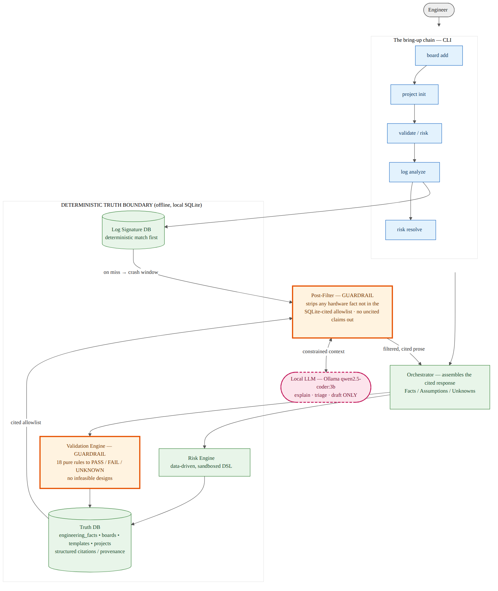

# EAEDK — Embedded AI Engineering Development Kit

## Getting started

New here? Copy-paste these one at a time. By the last line you'll see your board's learning path.

```bash
# 1. Download EAEDK to your computer.
git clone https://github.com/Ashut90/eaedk
# 2. Go into the folder you just downloaded.
cd eaedk
# 3. Make a private workspace so this install can't affect the rest of your system.
python3 -m venv .venv
# 4. Switch into that workspace (your prompt will show "(.venv)").
source .venv/bin/activate
# 5. Install EAEDK. This creates the "eaedk" command you'll use from here on.
pip install -e .
# 6. Create EAEDK's local database (one small file on your computer).
eaedk db init
# 7. Load the built-in boards, templates, and knowledge into that database.
eaedk db seed
# 8. See the boards EAEDK already knows — pick the one you have.
eaedk board list
# 9. Ask EAEDK to mentor you on a board (here, the popular $2 STM32 "Blue Pill").
eaedk mentor --board STM32F103-BluePill
```

That last command prints what the board can do, a learning path in order, and an exact
copy-paste recipe for building your first program. Coming back later? Just `cd eaedk`,
`source .venv/bin/activate`, and you're ready — steps 1–7 are one-time only.

**Prefer a browser?** Install the optional Web UI and open it — same engine, point-and-click:

```bash
pip install -e '.[web]'   # one-time: adds the web interface
eaedk web                 # opens at http://localhost:8080
```

> ## The LLM cannot assert a hardware fact. It can only reason from what the database has verified.

Every other AI coding tool will happily tell you the STM32F407 runs at 168 MHz, invent a DDR
timing, or guess a register address — confidently, and sometimes wrong. On embedded hardware a
wrong value destroys boards. **EAEDK makes that failure mode structurally impossible.**

The local model never sees raw hardware truth and never gets to claim it. It sits *outside* a
deterministic truth boundary and may only **explain, triage, and draft** over data the engines
have already verified. Anything it says that isn't backed by a citation in the database is
stripped before you ever read it.

That inversion — deterministic engines hold the truth, the LLM is a thin, replaceable
convenience layer — is the whole product.

## Architecture at a glance

Two front doors (CLI + Web) call the same deterministic engine core; every fact flows through
`repo.py` into local SQLite. The LLM sits **outside** the trust boundary and reaches the user
only through the post-filter. Full walk-through in **[docs/architecture-flow.md](docs/architecture-flow.md)**.



## The two guardrails

EAEDK is built around two deterministic gates the LLM cannot bypass:

1. **Validation Engine (input guard).** 18 pure-function rules return `PASS / FAIL / UNKNOWN`
   over typed board data — flash/RAM capacity, VTOR alignment (architecture-derived),
   partition fitment, DDR-timing-verified, power sequencing, pin-mux conflicts, and more —
   plus a **Toolchain Engine** that makes the build environment first-class: a host with no
   `arm-none-eabi-gcc` makes a Cortex-M project `NOT FEASIBLE`, with a one-line fix.
   `UNKNOWN` is a hard blocker, not a soft pass. Infeasible designs never get recommended.
2. **Post-Filter (output guard).** Every LLM response is scanned; any hex address, memory
   size, clock, or timing **not in the SQLite-cited allowlist** is removed and replaced with
   `[uncited claim removed — verify against TRM]`. Frequencies and timings are never in the
   DB, so the model can never sneak one through.



See **[docs/architecture.md](docs/architecture.md)** for this diagram's source and a full read-through,
and **[docs/architecture-flow.md](docs/architecture-flow.md)** for the complete software flow
(system architecture + the datasheet-ingestion pipeline).

## The mentor layer (teach, not just flag)

A status flag tells an expert what's wrong; it leaves a beginner stuck. So every toolchain
`FAIL`/`UNKNOWN` carries a one-line **`teach`**: *why it matters* and *what to do*. It shows in
both `toolchain validate` and `eaedk validate`:

```
FAIL [HIGH] TOOLCHAIN_TARGET_TRIPLE: detected compiler target(s) ['x86_64'] do not match arm
   ↳ Cortex-M is bare-metal ARM (Thumb); the host gcc cannot produce firmware for this MCU.
     Fix: apt install gcc-arm-none-eabi.
```

Every **validation** `UNKNOWN`/`FAIL` teaches too — what the field is, its units, where to find
it, and what breaks without it (e.g. *"board.flash_bytes: total flash in bytes — datasheet
memory map, STM32F411RE = 524288; without it image-fit checks and export can't run"*). The tool
doesn't just gate you, it teaches you past the gate — and the explanations are curated data, not
LLM-generated, so they're trustworthy and offline.

**`eaedk mentor --board <name>`** is the full vision: a senior engineer next to a beginner. It
lists the board's capabilities in plain language, gives a learning path in deliberate order
(Blink → UART → SPI sensor → … with the *reason* each comes before the next), and `export`
generates **working, teach-commented starter code** (every non-obvious line explained) plus a
`START_HERE.md`. An optional **Actor-Critic** pass (`--review-code`) hardens the scaffold — the
LLM critiques for beginner mistakes, but the **Validation Engine deterministically arbitrates**
every memory claim before it's shown as confirmed. See
[docs/11-mentor-layer.md](docs/11-mentor-layer.md).

## The bring-up chain

A complete, auditable workflow — every step writes through one fact layer with structured
provenance, no raw SQL:

```
board add ─► project init ─► validate / risk ─► log analyze ─► risk resolve ─► export
(onboard)   (auto-template,   (deterministic    (signatures +   (close with    (real files
            assess @ min-0)    PASS/FAIL/UNK)     cited triage)   provenance)    when feasible)
```

The standout capability: **project-aware log triage**. A vague U-Boot hang with no smoking gun
is correlated against the project's *own* unverified gaps and triaged to a specific
architectural assumption — then written back as a tracked risk **with zero manual correlation.**
The LLM proposes; the deterministic layer decides and records.

## Watch the demo

[](https://asciinema.org/a/w1gmp5g7DxaZMPnR)

The **complete chain** on an STM32F103, in one run: onboard the board → ingest its datasheet
(cited facts you confirm) → start a bare-metal project → check the build environment → validate
deterministically (each UNKNOWN explains itself) → export real build files → then feed a
**HardFault crash log** and watch EAEDK match the fault and teach what to check — without ever
guessing a hardware value.

A focused **DDR-triage** scenario is also recorded — a vague U-Boot hang correlated to a
specific unverified DDR timing, written back as a tracked risk, and resolved:
[asciinema.org/a/Qn8aqCKKsNrOzE0R](https://asciinema.org/a/Qn8aqCKKsNrOzE0R).

## Try it (offline)

First-time setup is in [Getting started](#getting-started) above (`pip install -e .` → `eaedk db
init` → `eaedk db seed`). Everything below assumes you've done that and your `(.venv)` is active.

```bash
eaedk eval run                         # -> PASSED 14/14 (deterministic golden cases)

# Optional LLM layer (off by default):
ollama pull qwen2.5-coder:3b
./demo.sh                              # full STM32MP157 DDR triage, end to end
```

`./demo.sh` runs the headline DDR-triage scenario above. **`./demo-full.sh`** runs the
*complete* chain on an STM32F103 — board add → datasheet ingest (cited) → project init
(`bare_metal_app`) → toolchain check → validate → export real build files → feed a HardFault
log and get a signature match **with teach**. Record either with
`asciinema rec -c "DEMO_PAUSE=3 ./demo-full.sh"`.

## Commands

```bash
eaedk mentor --board <name>            # plain-language capabilities + a learning path with reasons
eaedk mentor --board <name> --explain HardFault   # explain a concept (anchor offline; LLM opt-in)
eaedk board add --interactive          # guided onboarding: live fitment + VTOR checks + cited facts
eaedk ingest --file ds.pdf --board <b> # extract cited fact candidates from a datasheet PDF
eaedk ingest --board <b> --review      # review candidates; --confirm <id> commits (human-in-the-loop)
eaedk project init                     # guided: name, board, goal -> auto-template + immediate assess
eaedk toolchain detect                 # inventory the host build environment
eaedk toolchain validate --project <p> # cross-check tools vs board arch + goal (with fixes)
eaedk validate <project>               # cited PASS/FAIL/UNKNOWN (incl. toolchain) + Facts/Assumptions/Unknowns
eaedk log analyze --file <log> --project <p> --project-aware --llm
eaedk risk show <project>              # live risk-engine + tracked + resolved risks
eaedk risk resolve <id> --note "..."   # close a tracked risk (warns if item still unverified)
eaedk export <project> [--out DIR]     # checklist + CMake scaffold + flash steps as real files
eaedk --llm ask <project> "..."        # cited explanation; post-filtered; off by default
```

Goal types / templates: `bare_metal_app` (blink/UART — the beginner's first project),
`bootloader`, `uboot`, `linux`, `ota`, `driver` (six versioned-YAML templates), plus custom
(template-less) projects.

## Design decisions that matter

- **Local-first, offline-only.** One SQLite file; no per-token cost; works air-gapped. The
  quality ceiling of a small local model is *fine* precisely because it isn't the source of
  truth.
- **Evolve, not fork.** Facts live in one polymorphic layer (`facts` + the
  `engineering_facts` view) with structured citations — board *identity* stays typed for fast,
  safe rule lookups. (See [docs/03-truth-layer.md](docs/03-truth-layer.md).)
- **Confidence is capped, not configurable.** A board with any UNKNOWN core field can never be
  marked HIGH confidence.

## Layout

```
core/eaedk/
  store/              SQLite + forward-only migrations
  engines/
    validation/       18 pure-function rules (the trust core)
    risk/             data-driven rules over a sandboxed mini-DSL (no eval())
    toolchain/        host detection + build-environment validation (with teach layer)
    ingest/           datasheet PDF -> cited fact candidates (PyMuPDF, optional); review/confirm
    logs/             format detection, signature matching, async triage, write-back
  llm/                gateway (Ollama) + post-filter + constrained prompts
  orchestrator/       deterministic-first assembly of the fixed response schema
  onboard.py          interactive board wizard      project_init.py  interactive project setup
  repo.py             one place for DB access + record_fact() write-through
packages/             8 templates, 14 seed boards, risk rules, log signatures, eval cases
docs/                 architecture review, MVP spec, truth-layer, log-engine, this README's diagram
demo.sh               end-to-end STM32MP157 DDR demo
```

## Status

MVP through V1 complete and green: **85 pytests, eval 11/11.** Tags `v0.1.0` → `v1.5.0`.
Deterministic core (validation, risk, signatures, **toolchain**), unified truth layer, offline
LLM with post-filter, project-aware triage with write-back, the full interactive onboarding
chain, a feasibility-gated **output engine** that exports real build artifacts, **datasheet
ingestion** that extracts cited fact candidates from PDFs, and a **mentor layer** (v1.3.0) —
MCU crash signatures (Cortex-M HardFault, ESP32 Guru Meditation), arch-default toolchain teach
for any board, and a beginner `bare_metal_app` template. The mentor layer is evidence-backed by
a real-hardware dogfood ([docs/10-dogfood-findings.md](docs/10-dogfood-findings.md)).

```bash
PYTHONPATH=core python3 -m pytest -q
```

> Reason first. Build second. Verify always.
