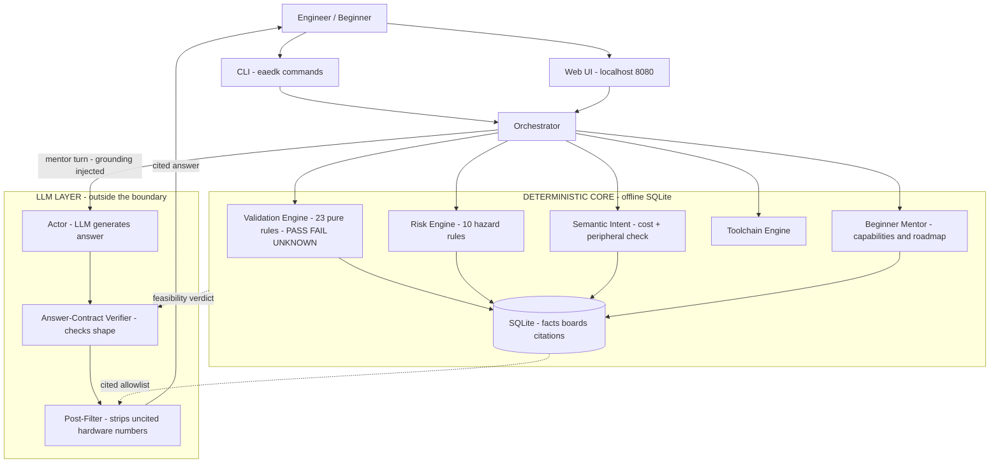
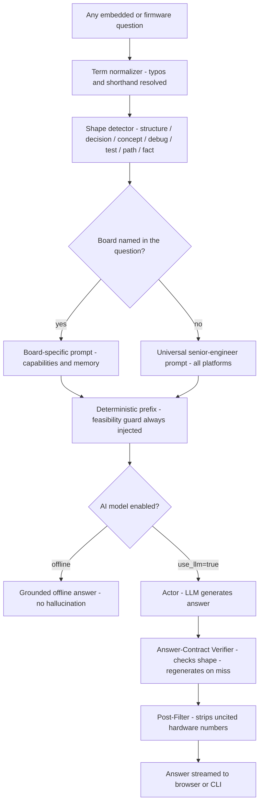
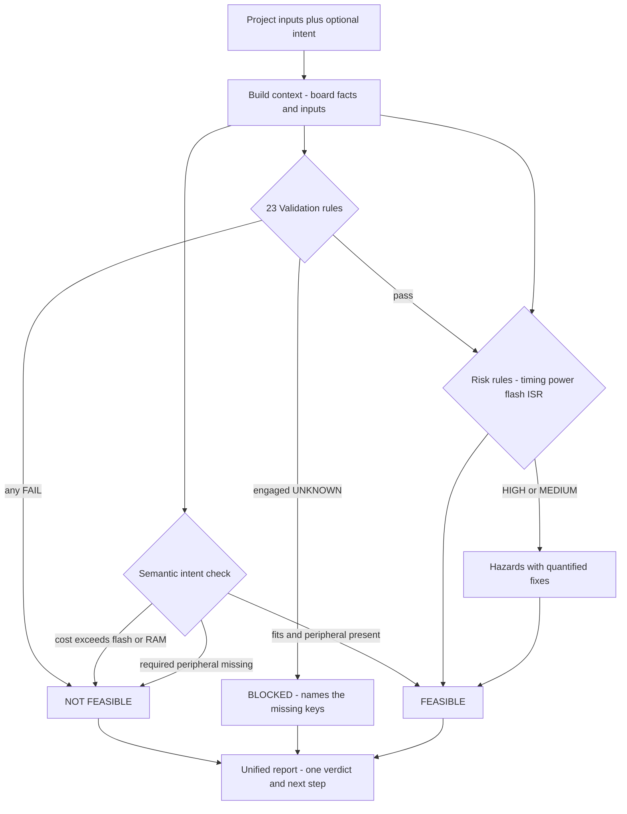
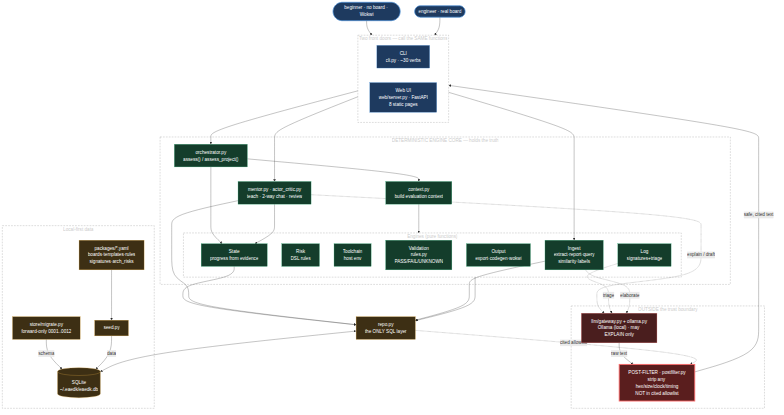
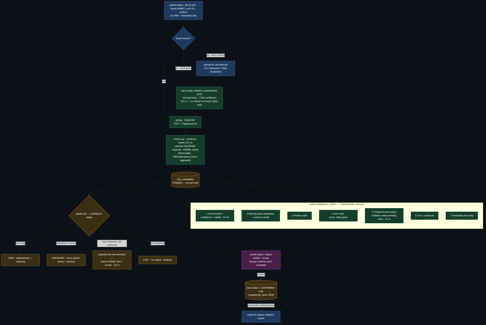

# EAEDK — Embedded AI Engineering Development Kit

**A local-first firmware mentor and validation engine. Deterministic engines hold the truth; an
optional local LLM only explains.** It tells a zero-experience engineer what a board can do, what
to build first and in what order, catches architectural mistakes *before* they build them, and
refuses — with the math — anything the hardware cannot do.

> **The LLM cannot assert a hardware fact. It can only reason from what the database has verified.**

Every other AI coding tool will happily tell you the STM32F407 runs at 168 MHz, invent a DDR
timing, or guess a register address — confidently, and sometimes wrong. On embedded hardware a
wrong value destroys boards. **EAEDK makes that failure mode structurally impossible.** The local
model sits *outside* a deterministic truth boundary and may only **explain, triage, and draft**
over data the engines have already verified; anything it says that isn't backed by a citation is
stripped before you read it.

---

## System requirements

EAEDK runs on **Linux, macOS, and Windows**. The table below lists what you need before you install.

| | Minimum | Recommended |
|---|---|---|
| **OS** | Ubuntu 20.04 · macOS 12 (Monterey) · Windows 10 | Ubuntu 22.04+ · macOS 14+ · Windows 11 |
| **Python** | 3.11 | 3.12 |
| **RAM** | 2 GB (CLI only) | 8 GB+ (for local LLM models) |
| **Disk** | 200 MB (EAEDK + DB) | 6–10 GB (+ LLM model weights) |
| **GPU** | Not required | CUDA GPU speeds up LLM inference |
| **Ollama** | Not required (offline mode works) | [ollama.com](https://ollama.com) — for AI answers |

> **Offline mode always works.** All 23 validation rules, the risk engine, log analysis, and
> the beginner mentor run with zero network and zero GPU — pure Python + one SQLite file.
> The LLM layer is strictly opt-in (`--llm` flag or the Web UI toggle).

---

## Install — one command

```bash
# 1. Clone the repo
git clone https://github.com/Ashut90/eaedk && cd eaedk

# 2. Install everything — web UI + datasheet ingestion + LLM-ready (stdlib only, no extra deps)
pip install -e '.[full]'

# 3. Initialise the local database
eaedk db init && eaedk db seed

# 4. Start the web interface (open http://localhost:8080)
eaedk web
```

`pip install -e '.[full]'` installs:
- the `eaedk` CLI command
- the **web UI** (FastAPI + Uvicorn → `eaedk web`)
- the **datasheet ingestion** engine (PyMuPDF → `eaedk ingest`)
- the **LLM layer** — built on Python's stdlib `urllib`, no extra package required

> **Windows users:** replace `pip install -e '.[full]'` with `pip install -e ".[full]"` (double
> quotes). PowerShell squote handling differs.

### Or install only what you need

```bash
pip install -e .              # CLI only (PyYAML — one dependency)
pip install -e '.[web]'       # + web UI  (FastAPI, Uvicorn)
pip install -e '.[ingest]'    # + datasheet PDF engine  (PyMuPDF)
pip install -e '.[full]'      # everything above at once
```

---

## Quick start (CLI)

```bash
eaedk board list                                       # see the 14 built-in boards
eaedk board capabilities --board bluepill              # what can a Blue Pill do?
eaedk mentor --board bluepill --level 0                # first project + reason it comes first
eaedk mentor --board bluepill --ask "explain HardFault"  # concept anchor
```

Fuzzy names work everywhere — `bluepill`, `stm32`, `pico`, `esp32` are all auto-resolved.

---

## Add the AI model (optional)

EAEDK answers **fully offline by default** — all checks, learning paths, and concept anchors work
with no model. For AI-generated, question-specific answers add `--llm` to any command, or flip the
toggle in the web UI. You need **Ollama** running locally.

### Install Ollama

| OS | Command |
|---|---|
| Linux | `curl -fsSL https://ollama.com/install.sh \| sh` |
| macOS | Download the app from [ollama.com](https://ollama.com) |
| Windows | Download the installer from [ollama.com](https://ollama.com) |

### Pull a model

```bash
ollama pull deepseek-r1:8b          # default — best reasoning for embedded questions
```

`deepseek-r1:8b` is the recommended default: it uses a `<think>` reasoning chain that EAEDK strips
before the answer reaches you (you only see the final answer, not the internal reasoning).

**Model guide:**

| Model | Size | GPU RAM needed | Good for |
|---|---|---|---|
| `deepseek-r1:8b` | 5 GB | 6 GB | Default — strong reasoning, fast on modern laptops |
| `llama3.1:8b` | 5 GB | 6 GB | Alternative — if you prefer Llama |
| `deepseek-r1:14b` | 9 GB | 10 GB | Better answers on complex bring-up questions |
| `deepseek-r1:32b` | 20 GB | 22 GB+ | Best quality; needs a decent GPU |
| any OpenAI-compatible | — | — | Cloud / hosted models (see below) |

> **Avoid 3B models** — they recite templates instead of reasoning. Stick to 7B+.

### Use a cloud or hosted model

Any OpenAI-compatible endpoint works — OpenRouter, Gemini API, vLLM, OpenCode Zen, etc.:

```bash
export EAEDK_LLM_BASE_URL=https://openrouter.ai/api/v1
export EAEDK_LLM_API_KEY=sk-...
export EAEDK_MENTOR_MODEL=deepseek/deepseek-r1
eaedk mentor --board bluepill --ask "explain DDR timing" --llm
```

A stronger cloud model gives sharper answers **without** losing the no-hallucinated-hardware-facts
guarantee — EAEDK's deterministic grounding and post-filter always wrap the model.

### Environment variables

| Variable | Default | Description |
|---|---|---|
| `EAEDK_MENTOR_MODEL` | `deepseek-r1:8b` | Model name for Ollama or the remote endpoint |
| `EAEDK_OLLAMA_HOST` | `http://localhost:11434` | Ollama host URL |
| `EAEDK_LLM_BASE_URL` | *(unset — uses Ollama)* | Set to switch to any OpenAI-compatible API |
| `EAEDK_LLM_API_KEY` | *(unset)* | API key for the remote endpoint |

---

## Web UI — http://localhost:8080

```bash
eaedk web       # starts at http://localhost:8080
```

Eight pages, one coherent workflow. Every page has a floating **"Ask EAEDK"** chat button — ask why
a check failed, what a build file does, or anything else about your board or project. Answers
stream word-by-word from the same mentor pipeline the CLI uses.

| Page | What it does |
|---|---|
| **Boards** | Click any board → capabilities, learning path, architecture. Inline chat for project/getting-started questions. |
| **New Project** | Pick board + goal → instant feasibility check + risk list. Links to Validate and Export with the project pre-selected. |
| **Validate** | Select a project → 23 checks run automatically, explained in plain English. One-click to Export or Code Studio. |
| **Code Studio** | Edit the generated template, click Review. Engine confirms real bugs (RED); AI suggests improvements (YELLOW). |
| **Export** | Generate real build files (CMake, linker script, START_HERE.md). Download as zip. Wokwi simulation files included. |
| **Log Analyzer** | Paste or drag a crash/boot log. Matches 100+ known failure signatures. Correlates with your project's open risks. |
| **Datasheet** | Upload a datasheet PDF. EAEDK extracts cited facts, lists what's missing, shows risk warnings. |
| **Mentor** | Full open-ended chat. Ask anything — Yocto, Jetson, career, RTOS, debugging — the model answers your actual question. |

Pages are connected: **New Project** → **Validate** → **Export** / **Code Studio** — each step
passes the project name through the URL so you never lose context.

---

## What's new — v4.0.0

### Answer-shape contracts (latest)

The mentor now **detects the shape** the question demands and verifies the LLM's output
deterministically against it. If the shape is wrong, the Actor **regenerates** (not rewrites — a
critic rewriting a correct answer was found to corrupt it):

| Shape detected | What the verifier checks |
|---|---|
| `concrete_structure` — "folder structure for X" | Answer must contain a real directory tree |
| `open_decision` — "X vs Y / should I A or B" | Answer must weigh both sides + close with a question |
| `concept` — "what is / explain X" | Short explanation + hardware consequence + next step |
| `debug_proof_path` — fault report | Routes to a deterministic decision tree (no LLM needed) |
| `test_plan` — "how do I test X" | Numbered, checkable plan |
| `learning_path` — "where do I start / roadmap" | Sequenced steps in dependency order |
| `fact_bound` — "how much flash / does this board have CAN" | Grounded fact from the DB |

### Reasoning model support

`deepseek-r1:8b` is now the default. EAEDK automatically:
- strips `<think>…</think>` tokens — you read the answer, not the model's scratchpad
- skips the Critic pass for reasoning models (the `<think>` chain replaces it)
- skips the Critic for concrete deliverables (code blocks, commands) — no corruption risk

### Front-door term normalization

Common typos and shorthand are normalised before the question reaches the mentor — `stm32f1`,
`blueplil`, `deepseekr1`, `freertos`, `yocoto` all ground correctly instead of being declined.

### "LLM generates, deterministic verifies" pivot

The model **reads and answers your specific question**; the deterministic engines **verify** it.
There is no topic gate — Jetson, Yocto, career, RTOS, and every embedded platform are answered.
The board you selected is *context* that enriches the answer, never a restriction on the subject.

---

## Architectural flow

Two front doors call the same deterministic engine core; every fact flows through `repo.py` into
local SQLite. The LLM sits **outside** the trust boundary and reaches you only through the
Answer-Contract verifier → **Post-Filter** pipeline.



Full walk-through: **[docs/architecture.md](docs/architecture.md)** and
**[docs/EAEDK-Technical-Documentation.pdf](docs/EAEDK-Technical-Documentation.pdf)**.

---

## Reasoning workflow — how the mentor actually thinks

The mentor answers **any** embedded / firmware question. There is no topic gate — Jetson, Yocto,
career, RTOS, every platform. The board you selected is *context* only; it never restricts the
subject.

Every turn:

1. **Term normalization** — typos and shorthand resolved before anything else.
2. **Shape detection** — what does this question demand? (structure / decision / concept / debug / test / path / fact)
3. **System prompt selection** — board-specific if a board is named; universal senior-engineer
   prompt otherwise (covers Cortex-M, Linux-on-hardware, Yocto, Jetson, RTOS, drivers, career — everything).
4. **Deterministic prefix** — feasibility banner + semantic-cost check injected, un-bypassable.
5. **LLM call** (if enabled) → **Answer-Contract verifier** (checks shape, regenerates if wrong) → **Post-Filter** (strips uncited hardware numbers).



---

## Sample interactions

| You ask | What you get |
|---|---|
| *"How do I start with Nvidia Jetson?"* | JetPack SDK, GPIO via libgpiod, CUDA, camera pipeline — no board default substituted. |
| *"When should I use Yocto vs Buildroot?"* | Decision criteria: project lifetime, team size, BSP complexity, CI footprint. Both compared side-by-side. |
| *"Should I learn Zephyr or FreeRTOS?"* | Decision criteria — when each wins, per-task RAM cost, how to decide. Not "start with blink." |
| *"I want to become a firmware engineer — where do I start?"* | Ordered learning path: blink → UART → SPI → interrupts → RTOS → bootloader → Linux drivers. |
| *"What is SPI?"* | Hardware consequence first (what breaks without it), then what to check next. |
| *"My code crashed with HardFault_Handler"* | Asks for CFSR/HFSR registers + faulting address. Routes to a deterministic proof-path. |
| *"Give me a folder structure for a Zephyr application"* | A real directory tree (detected as `concrete_structure` — verified by the Answer-Contract). |
| *"What project should I build with the WIZnet-W5500?"* | Board-specific: TCP echo server → HTTP → MQTT. Guided by the board's actual peripherals. |

---

## Validation logic

`eaedk validate <project>` runs **structural** checks and **behavioural intent** together,
aggregating hardware failures and intent-feasibility into one report. A hard failure anywhere
makes the whole project `NOT FEASIBLE`.



---

## The guardrails the LLM cannot bypass

1. **Validation Engine (input guard).** 23 pure-function rules return `PASS / FAIL / UNKNOWN` —
   flash/RAM capacity, VTOR placement, partition fitment, DDR timing, power sequencing, pin-mux
   conflicts, secure-boot, supply voltage, and more. `UNKNOWN` is a hard blocker. Infeasible
   designs never get recommended.
2. **Semantic Intent + behavioural hazards.** A cost table turns *"I want gRPC / TLS / a TFLite
   model"* into concrete flash/RAM ranges, checks them against the board, and verifies the board
   has the required peripheral. Ten risk rules cover flash endurance, ISR timing deadlines, power
   budget, and ISR-context stack.
3. **Answer-Contract verifier + Post-Filter (output guard).** The LLM generates; the
   deterministic verifier checks the answer's shape and regenerates if wrong. The Post-Filter
   strips any hex/size/clock/timing not in the SQLite-cited allowlist.

---

## The bring-up chain

```
board add ─► project init ─► validate / risk ─► log analyze ─► risk resolve ─► export
(onboard)   (auto-template,   (deterministic    (signatures +   (close with    (real files
            assess @ min-0)    PASS/FAIL/UNK)     cited triage)   provenance)    when feasible)
```

## Commands

```bash
# Mentor / learning
eaedk board capabilities --board <name>              # plain-language capabilities
eaedk mentor --board <name> --level 0                # first project + next 3, in dependency order
eaedk roadmap --board <name> --goal firmware-job     # job-focused path, multi-board
eaedk mentor --board <name> --ask "question" --llm   # AI answer for any embedded question

# Validation
eaedk validate <project>                             # cited PASS/FAIL/UNKNOWN
eaedk validate <project> --intent "mqtt freertos"    # + intent costing + peripheral checks
eaedk validate --board <name> --intent "grpc tls"    # quick stand-alone intent feasibility

# Build, triage, export
eaedk toolchain detect | validate --project <p>      # inventory + cross-check tools vs board
eaedk board add --interactive                        # guided onboarding with live checks
eaedk ingest --file ds.pdf --board <b> [--review]    # cited facts from a datasheet PDF
eaedk project init                                   # name, board, goal → template + assess
eaedk log analyze --file <log> --project <p> --llm   # boot log / crash triage
eaedk risk show <p> | risk resolve <id> --note "…"
eaedk export <project> [--out DIR]                   # real build files when feasible
```

---

## Architecture diagrams

### System architecture



### Trust boundary


### Datasheet ingestion flow



---

## Project layout

```
core/eaedk/
  store/              SQLite + forward-only migrations
  engines/
    validation/       23 pure-function rules (the trust core)
    risk/             10 data-driven hazard rules over a sandboxed mini-DSL (no eval())
    toolchain/        host detection + build-environment validation
    ingest/  logs/    datasheet PDF → cited facts; signature matching + triage
  answer_contract.py  shape detection + deterministic contract verification
  semantic_cost.py    intent → flash/RAM cost + peripheral prerequisites
  normalize.py        front-door term normalization (typos → canonical form)
  mentor_beginner.py  capabilities / recommendation / roadmap (beginner mentor)
  arbiter.py          feasibility arbiter — deterministic final say over LLM output
  llm/                gateway (Ollama / OpenAI-compat) + think-strip + post-filter + prompts
  orchestrator/       deterministic-first response assembly
  repo.py             the only DB access layer + record_fact() write-through
packages/             templates, 14 seed boards, risk rules, cost table, log signatures, eval cases
docs/                 architecture, truth-layer, EAEDK-Technical-Documentation.pdf
```

---

## Status

**380 pytests green, eval 20/20.**

| Tag | What shipped |
|---|---|
| `v2.7.0` | Trust-hardening: un-bypassable NOT-FEASIBLE guard, flash-endurance hazard, validation key transparency |
| `v3.0.0` | Beginner mentor (capabilities / recommendation / roadmap), semantic intent, behavioural hazards, Actor-Critic-Arbiter |
| `v3.1.0` | ML/AI intent costing, unified `validate --intent`, peripheral prerequisites, board-name auto-coercion |
| `v3.1.1` | Risk-engine resilience (a bad rule degrades, never 500s the assessment) |
| `v4.0.0` | **Open-answer mentor** — answers every embedded/firmware question; **full 8-page web UI** with streaming chat; connected page navigation |
| `v4.1.0` | **Answer-shape contracts** — shape detection + deterministic verification + Actor regeneration; `deepseek-r1:8b` default; reasoning-model `<think>` strip; concrete-deliverable fast path; front-door term normalization |

```bash
PYTHONPATH=core python3 -m pytest -q        # 380 passed
eaedk eval run                              # PASSED 20/20
```

> Reason first. Build second. Verify always.
