# EAEDK — Complete Software Flow

Rendered diagrams of the whole system (v2.3.1). Sources are Mermaid (`*.mmd`); the
`*.svg`/`*.png` are generated — regenerate after editing a source:

```sh
mmdc -i docs/architecture-flow.mmd -o docs/architecture-flow.svg -b transparent
mmdc -i docs/datasheet-flow.mmd    -o docs/datasheet-flow.svg    -b transparent
```

## 1. System architecture & trust boundary

Two front doors (CLI + Web) call the same deterministic engine core. Every fact flows
through `repo.py` into local SQLite. The LLM sits **outside** the boundary — it may explain,
but every number it emits is stripped by the post-filter unless the database or source already
cited it.


## 2. Datasheet intelligence pipeline (v2.3.x)

Unknown-board on-ramp → PDF read → sentence-aware extraction into **staged** `fact_candidates`
(not yet truth) → 7-section report + confidence-rated `ask` → human confirms → `facts` table
becomes the cited truth that feeds validate/export.



## Legend

| Colour | Layer |
|---|---|
| Blue | interface / gate (CLI, Web, decision points) |
| Green | deterministic engine (holds the truth) |
| Amber | data layer (`repo.py`, SQLite, YAML seed, staged candidates) |
| Purple | human-in-the-loop confirmation |
| Red | LLM (outside the boundary) and the post-filter that guards it |
