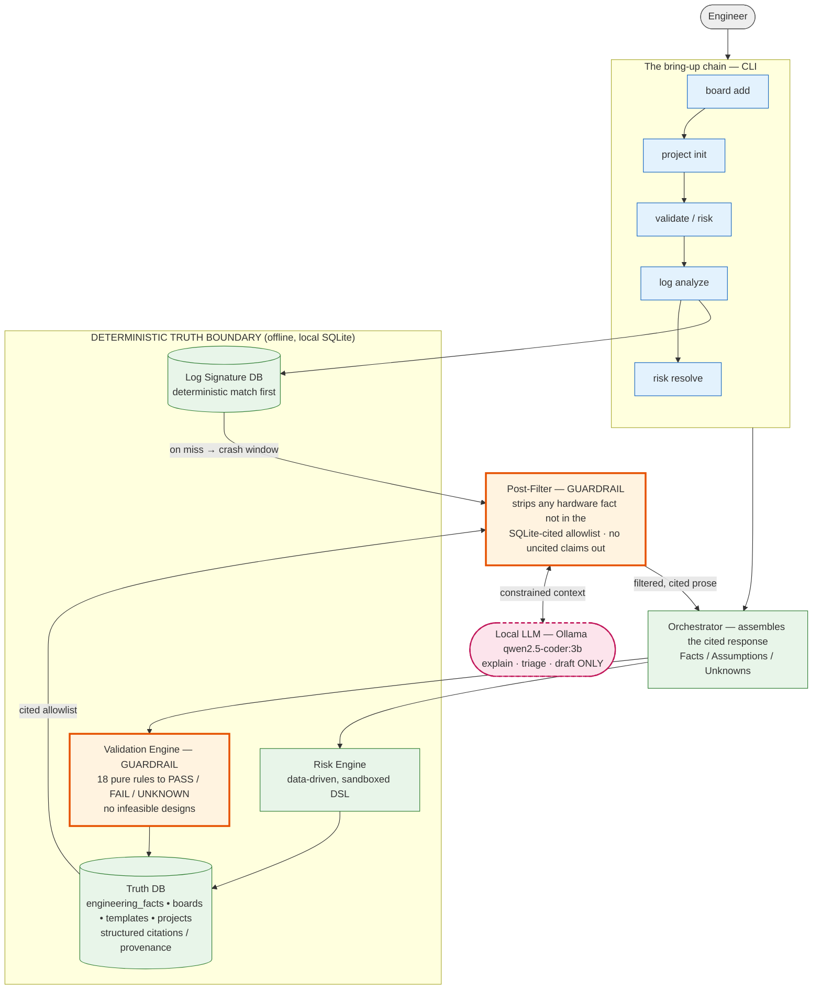

# EAEDK — Architecture & the Trust Boundary

The entire design exists to enforce one rule:

> **The LLM may explain, triage, and draft. It may never assert a hardware fact that the
> database has not verified.**

Everything inside the **truth boundary** is deterministic — pure-function validation, a
data-driven risk DSL, signature matching, and a SQLite store where every fact carries
structured provenance (`source → citation → page/section/snippet`). The LLM sits **outside**
that boundary and can only reach it through two guardrails:

- **Validation Engine** (input guard) — 18 pure rules return `PASS / FAIL / UNKNOWN`. An
  `UNKNOWN` is a hard blocker, not a soft pass; the orchestrator refuses to call a design
  feasible while a rule fails. Prevents infeasible architectures from ever being recommended.
- **Post-Filter** (output guard) — builds an allowlist of *cited* numbers from the
  `engineering_facts` view and strips any sentence in the model's output that asserts a hex
  address, memory size, clock, or timing not in that set. Frequencies/timings are never in the
  DB, so any such claim is removed by design.

## Reading the diagram

- The **LLM node is outside** the truth boundary and touches it only via the **Post-Filter**.
  It never reads or writes the database directly.
- Both **guardrails are orange**: the Validation Engine gates what goes *in* (feasibility),
  the Post-Filter gates what comes *out* (cited claims only).
- The **chain is linear and auditable**: `board add → project init → validate/risk →
  log analyze → risk resolve`. Each step writes through `repo.record_fact()` and the migration
  path — no raw SQL, every fact provenanced.

## The closing loop (project-aware log triage)

When `log analyze --project-aware` finds no deterministic signature match, it correlates the
crash window against the project's *own* unresolved gaps (FAIL / engaged-UNKNOWN validations,
unverified facts) and feeds them — not raw hardware values — to the LLM. A hypothesis that
implicates an existing gap is written back as a checklist note + a tracked risk (severity
inherited from the validation rule). `risk resolve` closes it with provenance. The LLM
proposes; the deterministic layer decides and records.

See [00-architecture-review.md](00-architecture-review.md) for the original design rationale,
and [03-truth-layer.md](03-truth-layer.md) for the fact-layer schema.
