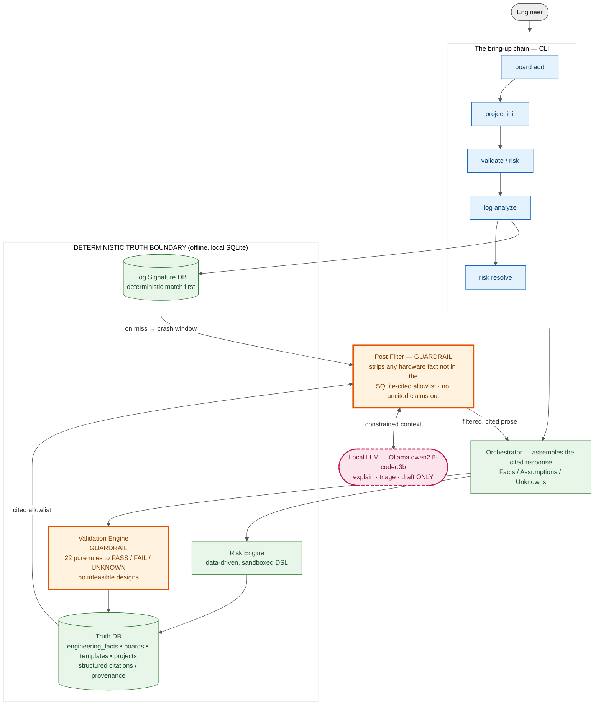

# EAEDK — Architecture & the Trust Boundary

The entire design exists to enforce one rule:

> **The LLM may explain, triage, and draft. It may never assert a hardware fact that the
> database has not verified.**

Everything inside the **truth boundary** is deterministic — pure-function validation, a
data-driven risk DSL, signature matching, and a SQLite store where every fact carries
structured provenance (`source → citation → page/section/snippet`). The LLM sits **outside**
that boundary and can only reach it through two guardrails:

- **Validation Engine** (input guard) — 22 pure rules return `PASS / FAIL / UNKNOWN`. An
  `UNKNOWN` is a hard blocker, not a soft pass; the orchestrator refuses to call a design
  feasible while a rule fails. Prevents infeasible architectures from ever being recommended.
- **Post-Filter** (output guard) — builds an allowlist of *cited* numbers from the
  `engineering_facts` view and strips any sentence in the model's output that asserts a hex
  address, memory size, clock, or timing not in that set. Frequencies/timings are never in the
  DB, so any such claim is removed by design.

> Static render (works in any viewer): 
> The live Mermaid source is below.

## Reading the diagram

- The **LLM node is outside** the truth boundary and touches it only via the **Post-Filter**.
  It never reads or writes the database directly.
- Both **guardrails are orange**: the Validation Engine gates what goes *in* (feasibility),
  the Post-Filter gates what comes *out* (cited claims only).
- The **chain is linear and auditable**: `board add → project init → validate/risk →
  log analyze → risk resolve`. Each step writes through `repo.record_fact()` and the migration
  path — no raw SQL, every fact provenanced.

## What the Post-Filter Does and Does Not Do

The Post-Filter is a structural guardrail, not an oracle. Its honesty depends on being clear
about its exact boundary — it is the *last* line of defence, never the source of truth.

**What it DOES:**

- Builds an allowlist of *cited* integer values from SQLite — board geometry fields,
  human-verified `engineering_facts`, and engineer-provided project inputs (including the
  integers nested inside region and partition structures).
- Scans the model's prose sentence-by-sentence for hardware-number patterns: hex addresses
  (`0x…`), memory sizes (`KB/KiB/MB/MiB/GB/GiB/B`), clock frequencies (`kHz/MHz/GHz`), and
  timing values (`ns/µs/ms`).
- Strips the **whole sentence** — replacing it with `[uncited claim removed — verify against
  TRM]` — when it asserts any such number that is not in the allowlist.
- Matches sizes against both binary and decimal multipliers, so a cited byte count still
  matches a `64 KB` mention regardless of the unit convention the model used.
- Removes **every** clock and timing assertion by design: frequencies and timings are never
  stored in the MVP database, so the LLM can never introduce a clock or timing number.

**What it DOES NOT do:**

- It does **not** judge logic or correctness. A sentence containing no hardware number passes
  through untouched, however wrong its engineering advice — reasoning quality is the
  mentor/reasoning layer's responsibility, not the filter's.
- It does **not** catch a wrong-but-cited number. The filter checks *provenance, not truth*: if
  a value is in the allowlist (e.g. the engineer entered a bad input, or a number coincidentally
  matches a cited one), the sentence survives.
- It does **not** understand units or meaning. It matches the numeric value, not the context —
  a correctly cited address used in the wrong claim is not detected.
- It does **not** rewrite, correct, or annotate claims. It deletes whole sentences; it never
  patches a number to the "right" one.
- It does **not** replace the Validation and Risk engines. Feasibility and risk are decided
  *before* the model runs, inside the truth boundary; the filter only constrains what the model
  is allowed to say on the way out.

In short: the Post-Filter guarantees that **no uncited hardware number leaves the system**. It
guarantees nothing about whether the surrounding reasoning is correct — that is what the
deterministic engines, not the filter, are for.

## The closing loop (project-aware log triage)

When `log analyze --project-aware` finds no deterministic signature match, it correlates the
crash window against the project's *own* unresolved gaps (FAIL / engaged-UNKNOWN validations,
unverified facts) and feeds them — not raw hardware values — to the LLM. A hypothesis that
implicates an existing gap is written back as a checklist note + a tracked risk (severity
inherited from the validation rule). `risk resolve` closes it with provenance. The LLM
proposes; the deterministic layer decides and records.

See [00-architecture-review.md](00-architecture-review.md) for the original design rationale,
and [03-truth-layer.md](03-truth-layer.md) for the fact-layer schema.
